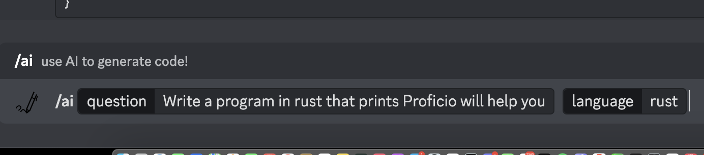
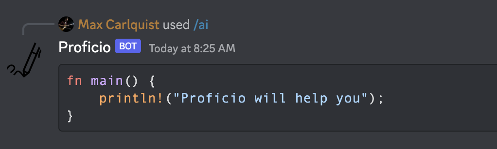

# Proficio

**Discord Slash command to help you with your coding questions using [open.ai](https://platform.openai.com/)**

![[result.png]]

## How to use
1. Type `/ai` to activate Proficio.
2. Proficio takes two arguments:
	1. The question (required =  true )
	2. the language format

